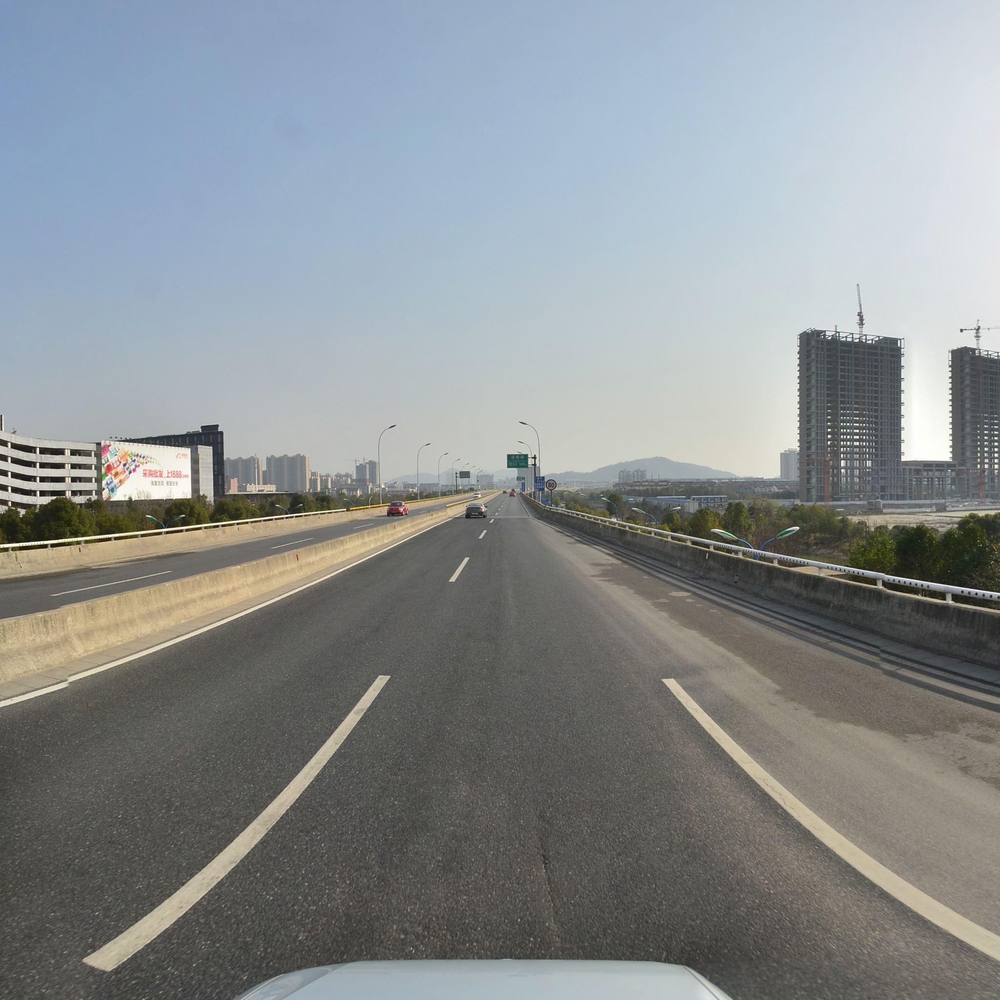
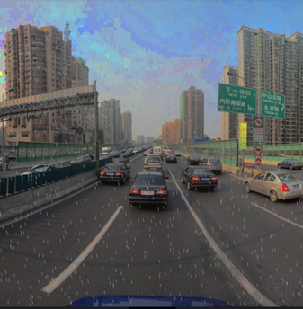
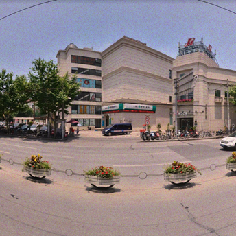
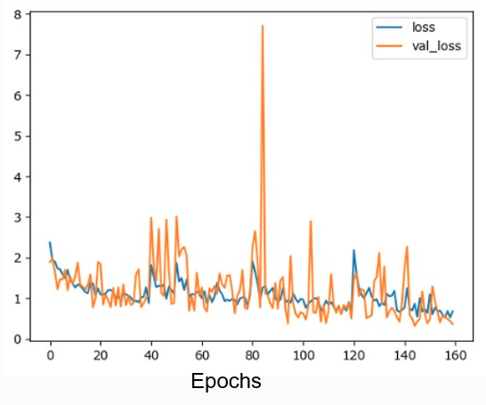
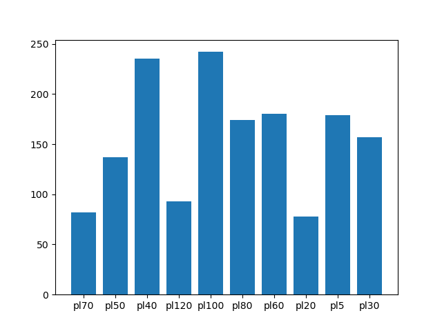
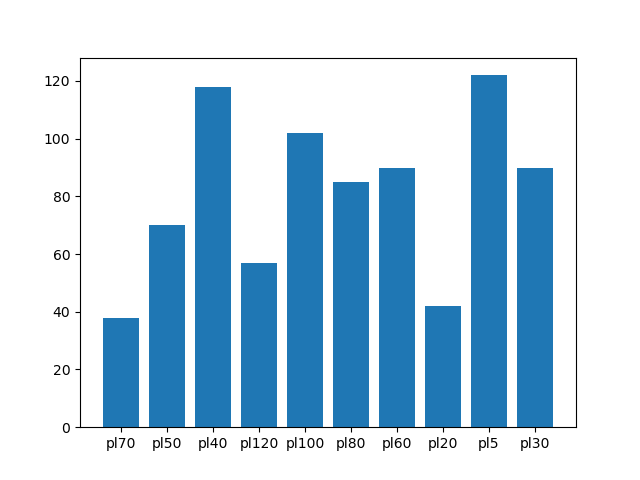
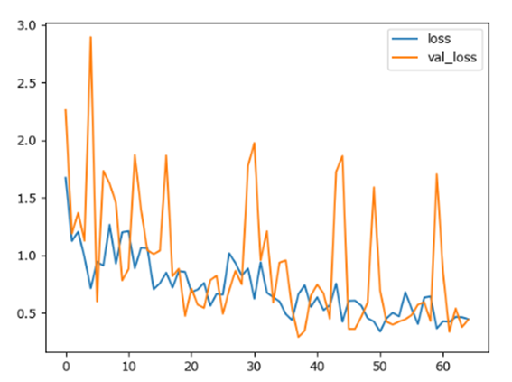

# CS539 Group Project

## Introduction
The locating and identification of traffic signs is key for driving agents to be successful in navigating roadways.  These signs come in varying shapes, sizes, colors, and patterns.  For this project, we explored the usage of the machine learning technique Mask R-CNN on a traffic sign dataset to measure the difference in performance while utilizing custom data augmentation methods.

## Related Work
We gave our paper presentation related to this paper on (Deep Learning for Large-Scale Traffic-Sign
Detection and Recognition)[https://doi.org/10.1109/TITS.2019.2913588].  The dataset within this paper contains a diverse selection of categories.  The paper discusses experiments on an augmented Mask R-CNN.  It also employs data augmentation to expand the size of its data.

## Tools
- [Vizhub](https://vizhub.com/): A website based around creating interactive data visualizations, created by @ckelleher@wpi.edu.  Using this tool, we were able to visualize properties of the dataset.
- [Jupyter Notebook](https://jupyter.org/): A project based around making reproducable and interactive python code with user friendly explanations.
- [Google Colab](https://research.google.com/colaboratory/): We used Google's cloud computing to run our Jupyter Notebook code and train/test our model.
- [Github](https://github.com/): We used github for source code managment and sharing.  We created several different branches using its version control to work on diverging aspects of the project.

## Dataset
Originally, we were going to use the (Mapillary Dataset)[https://www.mapillary.com/dataset/trafficsign] to run our model on, however, this dataset did not come with necessary features.  Namely, it was missing the masks for Mask-RCNN.

The dataset used is instead the TT100K ([Tsinghua-Tencent-100K](https://cg.cs.tsinghua.edu.cn/traffic-sign/)).  This dataset is split into three folders: test, train, and other.  In the parent folder, there is an annotations.json file which contains labels, masks, and bounding boxes for the images in the set.

The TTK100 has many categories of traffic signs (and a background category for images with no objects at all).  There are approximately 10K images in the set with traffic signs in them.  

## Data Pruning
The dataset was very large, and this greatly slowed Google Collab's ability to train a model on our data.  To remedy this, we pruned the data several different ways.

The first way we pruned the data was removing extraneous categories.  Many of the categories of the TT100K dataset have very small amounts of instances, or none at all.  To this end, we removed these categories by removing their annotations within the data.  While experimenting, we also explored the effect of removing images with these problematic categories instead.

We then split the dataset based on the divisions made in the dataset (train/other/test) and sought to cut down categories with excessively disproportionate intances.  To do this, sorted the images based on number of offending categories, then greedily removed them.  While greedily removing images, the algorithm passed over images that had rarer categories to ensure there remained enough instances.  Because of the combinatorial nature of this problem, a greedy search was used to avoid any np algorithms.

Finally, we removed a percentage of the images that were in the background category (images with no objects whatsoever).  This removed many images, especially from the other segment of the dataset.

## Data Augmentation
### Purpose
Our approach focused on augmenting the dataset, to make the resulting model better equipped to deal with real driving situations.  We experimented with different custom-made data augmentation technique subsets to see whether the base Mask-RCNN faired better or worse.

### Process
Before we utilized any of the data augmentation, we first trained a model on the base dataset.  We started with those weights when running further training using data augmentation.

For each epoch thereafter, we took a bootstrap sample of the dataset, then selected several of the images to be transformed with our augmentation effects (outlined below).  The epoch would then train on this data.

### Motion Blur
The first technique we used to augment the data was motion blur.  This was done because while a vehicle is in motion, a lower quality camera may take a blurry image.  To simulate this, we created a motion blur effect using cv2 kernels.  The strength of the effect actually scales with the speed limit of the image.  As location metadata was not provided within the dataset, the presence of speed signs were used instead.  The highest present speed sign within an image is what the 'speed' of the image is.

If no such speed signs exist, then a speed is sampled from a normal distribution. This normal distribution has mean and standard deviation derived from the subset of images containing speed signs within the data.

### Rain Particles
The next data augmentation technique we used was the simulation of rain.  To do this, we first lower the brightness of the image; rainy days are generally darker than clear days.  Then, we generate many locations to place raindrops and place the raindrops on the image using cv2.line().

### Random Noise
The last data augmentation technique we used was adding random noise to the image.  This was done by selecting points within the image and brightening or darkening them.

## Methodology
We trained a Mask R-CNN model within this project.  A brief summary of this technique is outlined within this section.

There are two primary modules within Mask R-CNN:
1. Region Proposal Network: Produces a set of rectangular shaped proposals for regions which may contain a class of interest.
2. Region-Based CNN: Accepts an input region proposal and outputs the class contained within that region.

The model is trained in four steps:
1. The Region Proposal Network is trained using the bounding boxes in the training set.
2. A detector network then gets trained based on the proposals generated by the Region Proposal Network.
3. The R-CNN module is initialized via the detector network and combine the convolution layers.
4. Finally, the fully connected layers of the R-CNN are fine-tuned.

A Feature Pyramid Network (FPN) is also utilized.  This approach is used to improve the model's performance on smaller objects within the image.  To do this, it extracts features from lower layers before downsampling occurs, preventing the loss of significant detail of these objects.

# Evaluation Metrics
- rpn_class_loss: Loss of the RPN for the class prediction.
- rpn_bbox_loss: Loss of the RPN because of bounding box differences
- mrcnn_class_loss: Loss of the MRCNN for the class prediction.
- mrcnn_bbox_loss: Loss of the bounding box refinement of the MRCNN.
- mrcnn_mask_loss: Cross entropy loss for the mask head.
- loss: aggregate of previous metrics.

## Results
Here is a graph of loss over epochs:

The model was only able to obtain 0.045 mAP.
We then tried again, but this time, only training on the speed limit signs to see if that made a significant difference.

Here are the sign distributions of the training and test set under these conditions:

Here is a graph of loss over epochs for this modified problem:

This model obtained a 0.02 mAP.  We believe it fared this way because speed signs look very similar to other signs, which are no longer labeled.

We believe that there were numerous problems within the dataset that caused this result.  The most egregious problem was the fact that the polygon/ellipse masks were not tightly fit to the images at all.  In fact, reducing the radii of the ellipses by half far more closely fit the images.  With this modification, the model received 0.25 mAP (a clear increase).

Finally, we added augmentations to the training set (but not the test set).  Doing so increased the mAP to 0.303 (another clear increase).

## Conclusion
While our training did not do very well in terms of our evaluation metrics, the result was improved through out data augmentation techniques.  We conclude that the data augmentation techniques we used successfully helped the model to become more generalized.

## Future Work
1. Improved M-RCNN: The paper we presented focused on modifications made to M-RCNN which allowed it to fare better on objects with small ROI (region of interest).  We did not make this modifications, and this may be part of the reason that our MAP was so low.
2. Attempt using different datasets to initialize the model: We only used the COCO imageset, which may not have been optimal for this task.  Trying different image collections to train on first may yield different and interesting results.
3. Search for alternate datesets: We only used the TT100K dataset within our experiments.  Unfortunately, this dataset contained many difficult images, obscured images, and masks that were not tightly fit to the signs they identified.  We should look for different datasets to do further experimentation on.

## Links
- [Code](https://github.com/adriannaStaszewska/CS539Project)
- [Presentation](https://wpi0-my.sharepoint.com/:p:/g/personal/ymao4_wpi_edu/EWkDtaueJTpHhs8x-Wj8HUwBRH5k6N54RdvddHyJOPJRxg?e=GN4w5x)

## Works Cited
- https://github.com/matterport/Mask_RCNN
- D. Tabernik, D. Skocaj, Deep Learning for Large-Scale Traffic-Sign Detection and Recognition, IEEE Trans. Intell. Transp. Syst. 21 (2020) 1427–1440. https://doi.org/10.1109/TITS.2019.2913588.
- H. Kaiming, G. Gkioxara, P. Dollar, and R. Girshick, “Mask R-CNN,” in International Conference on Computer Vision, 2017, pp. 2961–2969. 2, 3, 12
- S. Ren, K. He, R. Girshick, and J. Sun, “Faster R-CNN: Towards RealTime Object Detection with Region Proposal Networks,” in NIPS, 2015. 3

## Team
### Davesh Datwani (dbdatwani@wpi.edu)
No info provided

### Xingtong Guo (xguo3@wpi.edu)
I'm a PhD student at Worcester Polytechnic Institute, major in Civil and Environment Engineering. My research interests involve indoor air quality, pollutant control, occupants' wellbeing and behavior model.
My publications:
1. Xingtong Guo, Kyumin Lee, Zhe Wang, Shichao Liu, Occupants’ Satisfaction with LEED- and Non-LEED-Certified Apartments Using Social Media Data. Building and Environment, 2021, 206. https://doi.org/10.1016/j.buildenv.2021.108288
2. Xingtong Guo, Lijie Yin, Lihua Hu, Jianglin Cao, Hongwei Shen, Jiaqi Xua, Yuyan Hua,Chen Dezhen. Numerical simulation of wet deacidification process of sludge incineration flue gas. Fuel. 2020, 280. https://doi.org/10.1016/j.fuel.2020.118480
3. Lijie Yin, Yuanjie Jia, Xingtong Guo, Dezhen Chen, Zechen Jin. Flow behaviors and heat transfer characteristics of liquid film during the pyrolysis process of molten plastics using OpenFOAM. International Journal of Heat and Mass Transfer. 2019, 133:129-136. https://doi.org/10.1016/j.ijheatmasstransfer.2018.12.098

### Yujun Mao (ymao4@wpi.edu)
No info provided

### Daniel Ribaudo (dcribaudo@wpi.edu)
I am a Computer Science graduate student with undergraduate degrees in both Computer Science and Interactive Media Game Development from Worcester Polytechnic Institute.  I enjoy fencing, jogging, drinking coffee, and playing video games.

For this project, I worked on data visualization, the website, preprocessing the JSON files / otherwise preparing the data, and motion blur implementation.

### Adrianna Staszewska (azstaszewska@wpi.edu)
I am a Computer Science/Data Science double major. In my free time I enjoy reading, cooking and skiing.
For this project, I was responsible for setting up and training the model.

