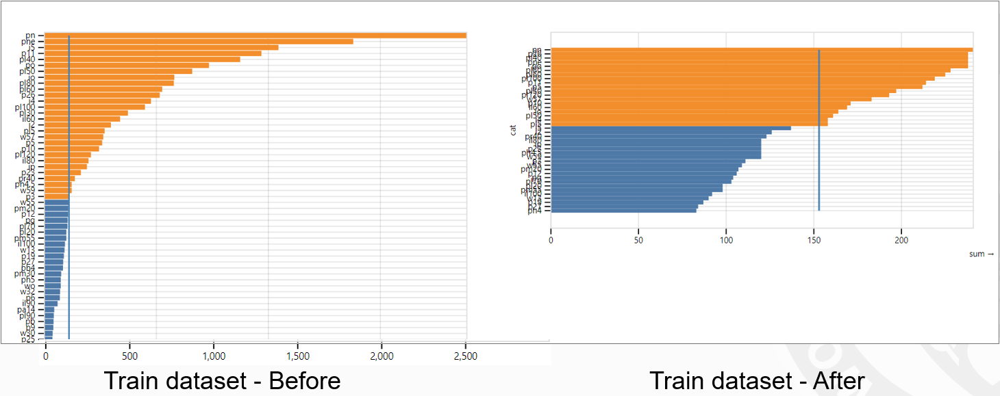

# CS539 Group Project

## Introduction
The locating and identification of traffic signs is key for driving agents to be successful in navigating roadways.  These signs come in varying shapes, sizes, colors, and patterns.  For this project, we explored the usage of the machine learning technique Mask R-CNN on a traffic sign dataset to measure the difference in performance while utilizing custom data augmentation methods.

## Related Work
We gave our paper presentation related to this paper on (Deep Learning for Large-Scale Traffic-Sign
Detection and Recognition)[https://doi.org/10.1109/TITS.2019.2913588].  The dataset within this paper contains a diverse selection of categories.  The paper discusses experiments on an augmented Mask R-CNN.  It also employs data augmentation to expand the size of its data.

## Tools
- [Vizhub](https://vizhub.com/): A website based around creating interactive data visualizations, created by @ckelleher@wpi.edu.  Using this tool, we were able to visualize properties of the dataset.
- [Jupyter Notebook](https://jupyter.org/): A project based around making reproducable and interactive python code with user friendly explanations.
- [Google Colab](https://research.google.com/colaboratory/): We used Google's cloud computing to run our Jupyter Notebook code and train/test our model.
- [Github](https://github.com/): We used github for source code managment and sharing.  We created several different branches using its version control to work on diverging aspects of the project.

## Dataset
Originally, we were going to use the (Mapillary Dataset)[https://www.mapillary.com/dataset/trafficsign] to run our model on, however, this dataset did not come with necessary features.  Namely, it was missing the masks for Mask-RCNN.

The dataset used is instead the TT100K ([Tsinghua-Tencent-100K](https://cg.cs.tsinghua.edu.cn/traffic-sign/)).  This dataset is split into three folders: test, train, and other.  In the parent folder, there is an annotations.json file which contains labels, masks, and bounding boxes for the images in the set.

The TTK100 has many categories of traffic signs (and a background category for images with no objects at all).  There are approximately 10K images in the set with traffic signs in them.  

## Data Pruning
The dataset was very large, and this greatly slowed Google Collab's ability to train a model on our data.  To remedy this, we pruned the data several different ways.

The first way we pruned the data was removing extraneous categories.  Many of the categories of the TT100K dataset have very small amounts of instances, or none at all.  To this end, we removed these categories by removing their annotations within the data.  While experimenting, we also explored the effect of removing images with these problematic categories instead.

We then split the dataset based on the divisions made in the dataset (train/other/test) and sought to cut down categories with excessively disproportionate intances.  To do this, sorted the images based on number of offending categories, then greedily removed them.  While greedily removing images, the algorithm passed over images that had rarer categories to ensure there remained enough instances.  Because of the combinatorial nature of this problem, a greedy search was used to avoid any np algorithms.

Finally, we removed a percentage of the images that were in the background category (images with no objects whatsoever).  This removed many images, especially from the other segment of the dataset.

## Data Augmentation
### Purpose
Our approach focused on augmenting the dataset, to make the resulting model better equipped to deal with real driving situations.  We experimented with different custom-made data augmentation technique subsets to see whether the base Mask-RCNN faired better or worse.

### Process
Before we utilized any of the data augmentation, we first trained a model on the base dataset.  We started with those weights when running further training using data augmentation.

For each epoch thereafter, we took a bootstrap sample of the dataset, then selected several of the images to be transformed with our augmentation effects (outlined below).  The epoch would then train on this data.

### Motion Blur
The first technique we used to augment the data was motion blur.  This was done because while a vehicle is in motion, a lower quality camera may take a blurry image.  To simulate this, we created a motion blur effect using cv2 kernels.  The strength of the effect actually scales with the speed limit of the image.  As location metadata was not provided within the dataset, the presence of speed signs were used instead.  The highest present speed sign within an image is what the 'speed' of the image is.

If no such speed signs exist, then a speed is sampled from a normal distribution. This normal distribution has mean and standard deviation derived from the subset of images containing speed signs within the data.

### Rain Particles
The next data augmentation technique we used was the simulation of rain.  To do this, we first lower the brightness of the image; rainy days are generally darker than clear days.  Then, we generate many locations to place raindrops and place the raindrops on the image using cv2.line().

### Random Noise
The last data augmentation technique we used was adding random noise to the image.  This was done by selecting points within the image and brightening or darkening them.

## Methodology
We trained a Mask R-CNN model within this project.  A brief summary of this technique is outlined within this section.

There are two primary modules within Mask R-CNN:
1. Region Proposal Network: Produces a set of rectangular shaped proposals for regions which may contain a class of interest.
2. Region-Based CNN: Accepts an input region proposal and outputs the class contained within that region.

The model is trained in four steps:
1. The Region Proposal Network is trained using the bounding boxes in the training set.
2. A detector network then gets trained based on the proposals generated by the Region Proposal Network.
3. The R-CNN module is initialized via the detector network and combine the convolution layers.
4. Finally, the fully connected layers of the R-CNN are fine-tuned.

A Feature Pyramid Network (FPN) is also utilized.  This approach is used to improve the model's performance on smaller objects within the image.  To do this, it extracts features from lower layers before downsampling occurs, preventing the loss of significant detail of these objects.

  
Layers

  

    Model: "mask_rcnn" 
__________________________________________________________________________________________________ 
Layer (type)                    Output Shape         Param #     Connected to                      
================================================================================================== 
input_image (InputLayer)        (None, None, None, 3 0                                             
__________________________________________________________________________________________________ 
zero_padding2d_4 (ZeroPadding2D (None, None, None, 3 0           input_image[0][0]                 
__________________________________________________________________________________________________ 
conv1 (Conv2D)                  (None, None, None, 6 9472        zero_padding2d_4[0][0]            
__________________________________________________________________________________________________ 
bn_conv1 (BatchNorm)            (None, None, None, 6 256         conv1[0][0]                       
__________________________________________________________________________________________________ 
activation_223 (Activation)     (None, None, None, 6 0           bn_conv1[0][0]                    
__________________________________________________________________________________________________ 
max_pooling2d_4 (MaxPooling2D)  (None, None, None, 6 0           activation_223[0][0]              
__________________________________________________________________________________________________ 
res2a_branch2a (Conv2D)         (None, None, None, 6 4160        max_pooling2d_4[0][0]             
__________________________________________________________________________________________________ 
bn2a_branch2a (BatchNorm)       (None, None, None, 6 256         res2a_branch2a[0][0]              
__________________________________________________________________________________________________ 
activation_224 (Activation)     (None, None, None, 6 0           bn2a_branch2a[0][0]               
__________________________________________________________________________________________________ 
res2a_branch2b (Conv2D)         (None, None, None, 6 36928       activation_224[0][0]              
__________________________________________________________________________________________________ 
bn2a_branch2b (BatchNorm)       (None, None, None, 6 256         res2a_branch2b[0][0]              
__________________________________________________________________________________________________ 
activation_225 (Activation)     (None, None, None, 6 0           bn2a_branch2b[0][0]               
__________________________________________________________________________________________________ 
res2a_branch2c (Conv2D)         (None, None, None, 2 16640       activation_225[0][0]              
__________________________________________________________________________________________________ 
res2a_branch1 (Conv2D)          (None, None, None, 2 16640       max_pooling2d_4[0][0]             
__________________________________________________________________________________________________ 
bn2a_branch2c (BatchNorm)       (None, None, None, 2 1024        res2a_branch2c[0][0]              
__________________________________________________________________________________________________ 
bn2a_branch1 (BatchNorm)        (None, None, None, 2 1024        res2a_branch1[0][0]               
__________________________________________________________________________________________________ 
add_100 (Add)                   (None, None, None, 2 0           bn2a_branch2c[0][0]               
                                                                 bn2a_branch1[0][0]                
__________________________________________________________________________________________________ 
res2a_out (Activation)          (None, None, None, 2 0           add_100[0][0]                     
__________________________________________________________________________________________________ 
res2b_branch2a (Conv2D)         (None, None, None, 6 16448       res2a_out[0][0]                   
__________________________________________________________________________________________________ 
bn2b_branch2a (BatchNorm)       (None, None, None, 6 256         res2b_branch2a[0][0]              
__________________________________________________________________________________________________ 
activation_226 (Activation)     (None, None, None, 6 0           bn2b_branch2a[0][0]               
__________________________________________________________________________________________________ 
res2b_branch2b (Conv2D)         (None, None, None, 6 36928       activation_226[0][0]              
__________________________________________________________________________________________________ 
bn2b_branch2b (BatchNorm)       (None, None, None, 6 256         res2b_branch2b[0][0]              
__________________________________________________________________________________________________ 
activation_227 (Activation)     (None, None, None, 6 0           bn2b_branch2b[0][0]               
__________________________________________________________________________________________________ 
res2b_branch2c (Conv2D)         (None, None, None, 2 16640       activation_227[0][0]              
__________________________________________________________________________________________________ 
bn2b_branch2c (BatchNorm)       (None, None, None, 2 1024        res2b_branch2c[0][0]              
__________________________________________________________________________________________________ 
add_101 (Add)                   (None, None, None, 2 0           bn2b_branch2c[0][0]               
                                                                 res2a_out[0][0]                   
__________________________________________________________________________________________________ 
res2b_out (Activation)          (None, None, None, 2 0           add_101[0][0]                     
__________________________________________________________________________________________________ 
res2c_branch2a (Conv2D)         (None, None, None, 6 16448       res2b_out[0][0]                   
__________________________________________________________________________________________________ 
bn2c_branch2a (BatchNorm)       (None, None, None, 6 256         res2c_branch2a[0][0]              
__________________________________________________________________________________________________ 
activation_228 (Activation)     (None, None, None, 6 0           bn2c_branch2a[0][0]               
__________________________________________________________________________________________________ 
res2c_branch2b (Conv2D)         (None, None, None, 6 36928       activation_228[0][0]              
__________________________________________________________________________________________________ 
bn2c_branch2b (BatchNorm)       (None, None, None, 6 256         res2c_branch2b[0][0]              
__________________________________________________________________________________________________ 
activation_229 (Activation)     (None, None, None, 6 0           bn2c_branch2b[0][0]               
__________________________________________________________________________________________________ 
res2c_branch2c (Conv2D)         (None, None, None, 2 16640       activation_229[0][0]              
__________________________________________________________________________________________________ 
bn2c_branch2c (BatchNorm)       (None, None, None, 2 1024        res2c_branch2c[0][0]              
__________________________________________________________________________________________________ 
add_102 (Add)                   (None, None, None, 2 0           bn2c_branch2c[0][0]               
                                                                 res2b_out[0][0]                   
__________________________________________________________________________________________________ 
res2c_out (Activation)          (None, None, None, 2 0           add_102[0][0]                     
__________________________________________________________________________________________________ 
res3a_branch2a (Conv2D)         (None, None, None, 1 32896       res2c_out[0][0]                   
__________________________________________________________________________________________________ 
bn3a_branch2a (BatchNorm)       (None, None, None, 1 512         res3a_branch2a[0][0]              
__________________________________________________________________________________________________ 
activation_230 (Activation)     (None, None, None, 1 0           bn3a_branch2a[0][0]               
__________________________________________________________________________________________________ 
res3a_branch2b (Conv2D)         (None, None, None, 1 147584      activation_230[0][0]              
__________________________________________________________________________________________________ 
bn3a_branch2b (BatchNorm)       (None, None, None, 1 512         res3a_branch2b[0][0]              
__________________________________________________________________________________________________ 
activation_231 (Activation)     (None, None, None, 1 0           bn3a_branch2b[0][0]               
__________________________________________________________________________________________________ 
res3a_branch2c (Conv2D)         (None, None, None, 5 66048       activation_231[0][0]              
__________________________________________________________________________________________________ 
res3a_branch1 (Conv2D)          (None, None, None, 5 131584      res2c_out[0][0]                   
__________________________________________________________________________________________________ 
bn3a_branch2c (BatchNorm)       (None, None, None, 5 2048        res3a_branch2c[0][0]              
__________________________________________________________________________________________________ 
bn3a_branch1 (BatchNorm)        (None, None, None, 5 2048        res3a_branch1[0][0]               
__________________________________________________________________________________________________ 
add_103 (Add)                   (None, None, None, 5 0           bn3a_branch2c[0][0]               
                                                                 bn3a_branch1[0][0]                
__________________________________________________________________________________________________ 
res3a_out (Activation)          (None, None, None, 5 0           add_103[0][0]                     
__________________________________________________________________________________________________ 
res3b_branch2a (Conv2D)         (None, None, None, 1 65664       res3a_out[0][0]                   
__________________________________________________________________________________________________ 
bn3b_branch2a (BatchNorm)       (None, None, None, 1 512         res3b_branch2a[0][0]              
__________________________________________________________________________________________________ 
activation_232 (Activation)     (None, None, None, 1 0           bn3b_branch2a[0][0]               
__________________________________________________________________________________________________ 
res3b_branch2b (Conv2D)         (None, None, None, 1 147584      activation_232[0][0]              
__________________________________________________________________________________________________ 
bn3b_branch2b (BatchNorm)       (None, None, None, 1 512         res3b_branch2b[0][0]              
__________________________________________________________________________________________________ 
activation_233 (Activation)     (None, None, None, 1 0           bn3b_branch2b[0][0]               
__________________________________________________________________________________________________ 
res3b_branch2c (Conv2D)         (None, None, None, 5 66048       activation_233[0][0]              
__________________________________________________________________________________________________ 
bn3b_branch2c (BatchNorm)       (None, None, None, 5 2048        res3b_branch2c[0][0]              
__________________________________________________________________________________________________ 
add_104 (Add)                   (None, None, None, 5 0           bn3b_branch2c[0][0]               
                                                                 res3a_out[0][0]                   
__________________________________________________________________________________________________ 
res3b_out (Activation)          (None, None, None, 5 0           add_104[0][0]                     
__________________________________________________________________________________________________ 
res3c_branch2a (Conv2D)         (None, None, None, 1 65664       res3b_out[0][0]                   
__________________________________________________________________________________________________ 
bn3c_branch2a (BatchNorm)       (None, None, None, 1 512         res3c_branch2a[0][0]              
__________________________________________________________________________________________________ 
activation_234 (Activation)     (None, None, None, 1 0           bn3c_branch2a[0][0]               
__________________________________________________________________________________________________ 
res3c_branch2b (Conv2D)         (None, None, None, 1 147584      activation_234[0][0]              
__________________________________________________________________________________________________ 
bn3c_branch2b (BatchNorm)       (None, None, None, 1 512         res3c_branch2b[0][0]              
__________________________________________________________________________________________________ 
activation_235 (Activation)     (None, None, None, 1 0           bn3c_branch2b[0][0]               
__________________________________________________________________________________________________ 
res3c_branch2c (Conv2D)         (None, None, None, 5 66048       activation_235[0][0]              
__________________________________________________________________________________________________ 
bn3c_branch2c (BatchNorm)       (None, None, None, 5 2048        res3c_branch2c[0][0]              
__________________________________________________________________________________________________ 
add_105 (Add)                   (None, None, None, 5 0           bn3c_branch2c[0][0]               
                                                                 res3b_out[0][0]                   
__________________________________________________________________________________________________ 
res3c_out (Activation)          (None, None, None, 5 0           add_105[0][0]                     
__________________________________________________________________________________________________ 
res3d_branch2a (Conv2D)         (None, None, None, 1 65664       res3c_out[0][0]                   
__________________________________________________________________________________________________ 
bn3d_branch2a (BatchNorm)       (None, None, None, 1 512         res3d_branch2a[0][0]              
__________________________________________________________________________________________________ 
activation_236 (Activation)     (None, None, None, 1 0           bn3d_branch2a[0][0]               
__________________________________________________________________________________________________ 
res3d_branch2b (Conv2D)         (None, None, None, 1 147584      activation_236[0][0]              
__________________________________________________________________________________________________ 
bn3d_branch2b (BatchNorm)       (None, None, None, 1 512         res3d_branch2b[0][0]              
__________________________________________________________________________________________________ 
activation_237 (Activation)     (None, None, None, 1 0           bn3d_branch2b[0][0]               
__________________________________________________________________________________________________ 
res3d_branch2c (Conv2D)         (None, None, None, 5 66048       activation_237[0][0]              
__________________________________________________________________________________________________ 
bn3d_branch2c (BatchNorm)       (None, None, None, 5 2048        res3d_branch2c[0][0]              
__________________________________________________________________________________________________ 
add_106 (Add)                   (None, None, None, 5 0           bn3d_branch2c[0][0]               
                                                                 res3c_out[0][0]                   
__________________________________________________________________________________________________ 
res3d_out (Activation)          (None, None, None, 5 0           add_106[0][0]                     
__________________________________________________________________________________________________ 
res4a_branch2a (Conv2D)         (None, None, None, 2 131328      res3d_out[0][0]                   
__________________________________________________________________________________________________ 
bn4a_branch2a (BatchNorm)       (None, None, None, 2 1024        res4a_branch2a[0][0]              
__________________________________________________________________________________________________ 
activation_238 (Activation)     (None, None, None, 2 0           bn4a_branch2a[0][0]               
__________________________________________________________________________________________________ 
res4a_branch2b (Conv2D)         (None, None, None, 2 590080      activation_238[0][0]              
__________________________________________________________________________________________________ 
bn4a_branch2b (BatchNorm)       (None, None, None, 2 1024        res4a_branch2b[0][0]              
__________________________________________________________________________________________________ 
activation_239 (Activation)     (None, None, None, 2 0           bn4a_branch2b[0][0]               
__________________________________________________________________________________________________ 
res4a_branch2c (Conv2D)         (None, None, None, 1 263168      activation_239[0][0]              
__________________________________________________________________________________________________ 
res4a_branch1 (Conv2D)          (None, None, None, 1 525312      res3d_out[0][0]                   
__________________________________________________________________________________________________ 
bn4a_branch2c (BatchNorm)       (None, None, None, 1 4096        res4a_branch2c[0][0]              
__________________________________________________________________________________________________ 
bn4a_branch1 (BatchNorm)        (None, None, None, 1 4096        res4a_branch1[0][0]               
__________________________________________________________________________________________________ 
add_107 (Add)                   (None, None, None, 1 0           bn4a_branch2c[0][0]               
                                                                 bn4a_branch1[0][0]                
__________________________________________________________________________________________________ 
res4a_out (Activation)          (None, None, None, 1 0           add_107[0][0]                     
__________________________________________________________________________________________________ 
res4b_branch2a (Conv2D)         (None, None, None, 2 262400      res4a_out[0][0]                   
__________________________________________________________________________________________________ 
bn4b_branch2a (BatchNorm)       (None, None, None, 2 1024        res4b_branch2a[0][0]              
__________________________________________________________________________________________________ 
activation_240 (Activation)     (None, None, None, 2 0           bn4b_branch2a[0][0]               
__________________________________________________________________________________________________ 
res4b_branch2b (Conv2D)         (None, None, None, 2 590080      activation_240[0][0]              
__________________________________________________________________________________________________ 
bn4b_branch2b (BatchNorm)       (None, None, None, 2 1024        res4b_branch2b[0][0]              
__________________________________________________________________________________________________ 
activation_241 (Activation)     (None, None, None, 2 0           bn4b_branch2b[0][0]               
__________________________________________________________________________________________________ 
res4b_branch2c (Conv2D)         (None, None, None, 1 263168      activation_241[0][0]              
__________________________________________________________________________________________________ 
bn4b_branch2c (BatchNorm)       (None, None, None, 1 4096        res4b_branch2c[0][0]              
__________________________________________________________________________________________________ 
add_108 (Add)                   (None, None, None, 1 0           bn4b_branch2c[0][0]               
                                                                 res4a_out[0][0]                   
__________________________________________________________________________________________________ 
res4b_out (Activation)          (None, None, None, 1 0           add_108[0][0]                     
__________________________________________________________________________________________________ 
res4c_branch2a (Conv2D)         (None, None, None, 2 262400      res4b_out[0][0]                   
__________________________________________________________________________________________________ 
bn4c_branch2a (BatchNorm)       (None, None, None, 2 1024        res4c_branch2a[0][0]              
__________________________________________________________________________________________________ 
activation_242 (Activation)     (None, None, None, 2 0           bn4c_branch2a[0][0]               
__________________________________________________________________________________________________ 
res4c_branch2b (Conv2D)         (None, None, None, 2 590080      activation_242[0][0]              
__________________________________________________________________________________________________ 
bn4c_branch2b (BatchNorm)       (None, None, None, 2 1024        res4c_branch2b[0][0]              
__________________________________________________________________________________________________ 
activation_243 (Activation)     (None, None, None, 2 0           bn4c_branch2b[0][0]               
__________________________________________________________________________________________________ 
res4c_branch2c (Conv2D)         (None, None, None, 1 263168      activation_243[0][0]              
__________________________________________________________________________________________________ 
bn4c_branch2c (BatchNorm)       (None, None, None, 1 4096        res4c_branch2c[0][0]              
__________________________________________________________________________________________________ 
add_109 (Add)                   (None, None, None, 1 0           bn4c_branch2c[0][0]               
                                                                 res4b_out[0][0]                   
__________________________________________________________________________________________________ 
res4c_out (Activation)          (None, None, None, 1 0           add_109[0][0]                     
__________________________________________________________________________________________________ 
res4d_branch2a (Conv2D)         (None, None, None, 2 262400      res4c_out[0][0]                   
__________________________________________________________________________________________________ 
bn4d_branch2a (BatchNorm)       (None, None, None, 2 1024        res4d_branch2a[0][0]              
__________________________________________________________________________________________________ 
activation_244 (Activation)     (None, None, None, 2 0           bn4d_branch2a[0][0]               
__________________________________________________________________________________________________ 
res4d_branch2b (Conv2D)         (None, None, None, 2 590080      activation_244[0][0]              
__________________________________________________________________________________________________ 
bn4d_branch2b (BatchNorm)       (None, None, None, 2 1024        res4d_branch2b[0][0]              
__________________________________________________________________________________________________ 
activation_245 (Activation)     (None, None, None, 2 0           bn4d_branch2b[0][0]               
__________________________________________________________________________________________________ 
res4d_branch2c (Conv2D)         (None, None, None, 1 263168      activation_245[0][0]              
__________________________________________________________________________________________________ 
bn4d_branch2c (BatchNorm)       (None, None, None, 1 4096        res4d_branch2c[0][0]              
__________________________________________________________________________________________________ 
add_110 (Add)                   (None, None, None, 1 0           bn4d_branch2c[0][0]               
                                                                 res4c_out[0][0]                   
__________________________________________________________________________________________________ 
res4d_out (Activation)          (None, None, None, 1 0           add_110[0][0]                     
__________________________________________________________________________________________________ 
res4e_branch2a (Conv2D)         (None, None, None, 2 262400      res4d_out[0][0]                   
__________________________________________________________________________________________________ 
bn4e_branch2a (BatchNorm)       (None, None, None, 2 1024        res4e_branch2a[0][0]              
__________________________________________________________________________________________________ 
activation_246 (Activation)     (None, None, None, 2 0           bn4e_branch2a[0][0]               
__________________________________________________________________________________________________ 
res4e_branch2b (Conv2D)         (None, None, None, 2 590080      activation_246[0][0]              
__________________________________________________________________________________________________ 
bn4e_branch2b (BatchNorm)       (None, None, None, 2 1024        res4e_branch2b[0][0]              
__________________________________________________________________________________________________ 
activation_247 (Activation)     (None, None, None, 2 0           bn4e_branch2b[0][0]               
__________________________________________________________________________________________________ 
res4e_branch2c (Conv2D)         (None, None, None, 1 263168      activation_247[0][0]              
__________________________________________________________________________________________________ 
bn4e_branch2c (BatchNorm)       (None, None, None, 1 4096        res4e_branch2c[0][0]              
__________________________________________________________________________________________________ 
add_111 (Add)                   (None, None, None, 1 0           bn4e_branch2c[0][0]               
                                                                 res4d_out[0][0]                   
__________________________________________________________________________________________________ 
res4e_out (Activation)          (None, None, None, 1 0           add_111[0][0]                     
__________________________________________________________________________________________________ 
res4f_branch2a (Conv2D)         (None, None, None, 2 262400      res4e_out[0][0]                   
__________________________________________________________________________________________________ 
bn4f_branch2a (BatchNorm)       (None, None, None, 2 1024        res4f_branch2a[0][0]              
__________________________________________________________________________________________________ 
activation_248 (Activation)     (None, None, None, 2 0           bn4f_branch2a[0][0]               
__________________________________________________________________________________________________ 
res4f_branch2b (Conv2D)         (None, None, None, 2 590080      activation_248[0][0]              
__________________________________________________________________________________________________ 
bn4f_branch2b (BatchNorm)       (None, None, None, 2 1024        res4f_branch2b[0][0]              
__________________________________________________________________________________________________ 
activation_249 (Activation)     (None, None, None, 2 0           bn4f_branch2b[0][0]               
__________________________________________________________________________________________________ 
res4f_branch2c (Conv2D)         (None, None, None, 1 263168      activation_249[0][0]              
__________________________________________________________________________________________________ 
bn4f_branch2c (BatchNorm)       (None, None, None, 1 4096        res4f_branch2c[0][0]              
__________________________________________________________________________________________________ 
add_112 (Add)                   (None, None, None, 1 0           bn4f_branch2c[0][0]               
                                                                 res4e_out[0][0]                   
__________________________________________________________________________________________________ 
res4f_out (Activation)          (None, None, None, 1 0           add_112[0][0]                     
__________________________________________________________________________________________________ 
res4g_branch2a (Conv2D)         (None, None, None, 2 262400      res4f_out[0][0]                   
__________________________________________________________________________________________________ 
bn4g_branch2a (BatchNorm)       (None, None, None, 2 1024        res4g_branch2a[0][0]              
__________________________________________________________________________________________________ 
activation_250 (Activation)     (None, None, None, 2 0           bn4g_branch2a[0][0]               
__________________________________________________________________________________________________ 
res4g_branch2b (Conv2D)         (None, None, None, 2 590080      activation_250[0][0]              
__________________________________________________________________________________________________ 
bn4g_branch2b (BatchNorm)       (None, None, None, 2 1024        res4g_branch2b[0][0]              
__________________________________________________________________________________________________ 
activation_251 (Activation)     (None, None, None, 2 0           bn4g_branch2b[0][0]               
__________________________________________________________________________________________________ 
res4g_branch2c (Conv2D)         (None, None, None, 1 263168      activation_251[0][0]              
__________________________________________________________________________________________________ 
bn4g_branch2c (BatchNorm)       (None, None, None, 1 4096        res4g_branch2c[0][0]              
__________________________________________________________________________________________________ 
add_113 (Add)                   (None, None, None, 1 0           bn4g_branch2c[0][0]               
                                                                 res4f_out[0][0]                   
__________________________________________________________________________________________________ 
res4g_out (Activation)          (None, None, None, 1 0           add_113[0][0]                     
__________________________________________________________________________________________________ 
res4h_branch2a (Conv2D)         (None, None, None, 2 262400      res4g_out[0][0]                   
__________________________________________________________________________________________________ 
bn4h_branch2a (BatchNorm)       (None, None, None, 2 1024        res4h_branch2a[0][0]              
__________________________________________________________________________________________________ 
activation_252 (Activation)     (None, None, None, 2 0           bn4h_branch2a[0][0]               
__________________________________________________________________________________________________ 
res4h_branch2b (Conv2D)         (None, None, None, 2 590080      activation_252[0][0]              
__________________________________________________________________________________________________ 
bn4h_branch2b (BatchNorm)       (None, None, None, 2 1024        res4h_branch2b[0][0]              
__________________________________________________________________________________________________ 
activation_253 (Activation)     (None, None, None, 2 0           bn4h_branch2b[0][0]               
__________________________________________________________________________________________________ 
res4h_branch2c (Conv2D)         (None, None, None, 1 263168      activation_253[0][0]              
__________________________________________________________________________________________________ 
bn4h_branch2c (BatchNorm)       (None, None, None, 1 4096        res4h_branch2c[0][0]              
__________________________________________________________________________________________________ 
add_114 (Add)                   (None, None, None, 1 0           bn4h_branch2c[0][0]               
                                                                 res4g_out[0][0]                   
__________________________________________________________________________________________________ 
res4h_out (Activation)          (None, None, None, 1 0           add_114[0][0]                     
__________________________________________________________________________________________________ 
res4i_branch2a (Conv2D)         (None, None, None, 2 262400      res4h_out[0][0]                   
__________________________________________________________________________________________________ 
bn4i_branch2a (BatchNorm)       (None, None, None, 2 1024        res4i_branch2a[0][0]              
__________________________________________________________________________________________________ 
activation_254 (Activation)     (None, None, None, 2 0           bn4i_branch2a[0][0]               
__________________________________________________________________________________________________ 
res4i_branch2b (Conv2D)         (None, None, None, 2 590080      activation_254[0][0]              
__________________________________________________________________________________________________ 
bn4i_branch2b (BatchNorm)       (None, None, None, 2 1024        res4i_branch2b[0][0]              
__________________________________________________________________________________________________ 
activation_255 (Activation)     (None, None, None, 2 0           bn4i_branch2b[0][0]               
__________________________________________________________________________________________________ 
res4i_branch2c (Conv2D)         (None, None, None, 1 263168      activation_255[0][0]              
__________________________________________________________________________________________________ 
bn4i_branch2c (BatchNorm)       (None, None, None, 1 4096        res4i_branch2c[0][0]              
__________________________________________________________________________________________________ 
add_115 (Add)                   (None, None, None, 1 0           bn4i_branch2c[0][0]               
                                                                 res4h_out[0][0]                   
__________________________________________________________________________________________________ 
res4i_out (Activation)          (None, None, None, 1 0           add_115[0][0]                     
__________________________________________________________________________________________________ 
res4j_branch2a (Conv2D)         (None, None, None, 2 262400      res4i_out[0][0]                   
__________________________________________________________________________________________________ 
bn4j_branch2a (BatchNorm)       (None, None, None, 2 1024        res4j_branch2a[0][0]              
__________________________________________________________________________________________________ 
activation_256 (Activation)     (None, None, None, 2 0           bn4j_branch2a[0][0]               
__________________________________________________________________________________________________ 
res4j_branch2b (Conv2D)         (None, None, None, 2 590080      activation_256[0][0]              
__________________________________________________________________________________________________ 
bn4j_branch2b (BatchNorm)       (None, None, None, 2 1024        res4j_branch2b[0][0]              
__________________________________________________________________________________________________ 
activation_257 (Activation)     (None, None, None, 2 0           bn4j_branch2b[0][0]               
__________________________________________________________________________________________________ 
res4j_branch2c (Conv2D)         (None, None, None, 1 263168      activation_257[0][0]              
__________________________________________________________________________________________________ 
bn4j_branch2c (BatchNorm)       (None, None, None, 1 4096        res4j_branch2c[0][0]              
__________________________________________________________________________________________________ 
add_116 (Add)                   (None, None, None, 1 0           bn4j_branch2c[0][0]               
                                                                 res4i_out[0][0]                   
__________________________________________________________________________________________________ 
res4j_out (Activation)          (None, None, None, 1 0           add_116[0][0]                     
__________________________________________________________________________________________________ 
res4k_branch2a (Conv2D)         (None, None, None, 2 262400      res4j_out[0][0]                   
__________________________________________________________________________________________________ 
bn4k_branch2a (BatchNorm)       (None, None, None, 2 1024        res4k_branch2a[0][0]              
__________________________________________________________________________________________________ 
activation_258 (Activation)     (None, None, None, 2 0           bn4k_branch2a[0][0]               
__________________________________________________________________________________________________ 
res4k_branch2b (Conv2D)         (None, None, None, 2 590080      activation_258[0][0]              
__________________________________________________________________________________________________ 
bn4k_branch2b (BatchNorm)       (None, None, None, 2 1024        res4k_branch2b[0][0]              
__________________________________________________________________________________________________ 
activation_259 (Activation)     (None, None, None, 2 0           bn4k_branch2b[0][0]               
__________________________________________________________________________________________________ 
res4k_branch2c (Conv2D)         (None, None, None, 1 263168      activation_259[0][0]              
__________________________________________________________________________________________________ 
bn4k_branch2c (BatchNorm)       (None, None, None, 1 4096        res4k_branch2c[0][0]              
__________________________________________________________________________________________________ 
add_117 (Add)                   (None, None, None, 1 0           bn4k_branch2c[0][0]               
                                                                 res4j_out[0][0]                   
__________________________________________________________________________________________________ 
res4k_out (Activation)          (None, None, None, 1 0           add_117[0][0]                     
__________________________________________________________________________________________________ 
res4l_branch2a (Conv2D)         (None, None, None, 2 262400      res4k_out[0][0]                   
__________________________________________________________________________________________________ 
bn4l_branch2a (BatchNorm)       (None, None, None, 2 1024        res4l_branch2a[0][0]              
__________________________________________________________________________________________________ 
activation_260 (Activation)     (None, None, None, 2 0           bn4l_branch2a[0][0]               
__________________________________________________________________________________________________ 
res4l_branch2b (Conv2D)         (None, None, None, 2 590080      activation_260[0][0]              
__________________________________________________________________________________________________ 
bn4l_branch2b (BatchNorm)       (None, None, None, 2 1024        res4l_branch2b[0][0]              
__________________________________________________________________________________________________ 
activation_261 (Activation)     (None, None, None, 2 0           bn4l_branch2b[0][0]               
__________________________________________________________________________________________________ 
res4l_branch2c (Conv2D)         (None, None, None, 1 263168      activation_261[0][0]              
__________________________________________________________________________________________________ 
bn4l_branch2c (BatchNorm)       (None, None, None, 1 4096        res4l_branch2c[0][0]              
__________________________________________________________________________________________________ 
add_118 (Add)                   (None, None, None, 1 0           bn4l_branch2c[0][0]               
                                                                 res4k_out[0][0]                   
__________________________________________________________________________________________________ 
res4l_out (Activation)          (None, None, None, 1 0           add_118[0][0]                     
__________________________________________________________________________________________________ 
res4m_branch2a (Conv2D)         (None, None, None, 2 262400      res4l_out[0][0]                   
__________________________________________________________________________________________________ 
bn4m_branch2a (BatchNorm)       (None, None, None, 2 1024        res4m_branch2a[0][0]              
__________________________________________________________________________________________________ 
activation_262 (Activation)     (None, None, None, 2 0           bn4m_branch2a[0][0]               
__________________________________________________________________________________________________ 
res4m_branch2b (Conv2D)         (None, None, None, 2 590080      activation_262[0][0]              
__________________________________________________________________________________________________ 
bn4m_branch2b (BatchNorm)       (None, None, None, 2 1024        res4m_branch2b[0][0]              
__________________________________________________________________________________________________ 
activation_263 (Activation)     (None, None, None, 2 0           bn4m_branch2b[0][0]               
__________________________________________________________________________________________________ 
res4m_branch2c (Conv2D)         (None, None, None, 1 263168      activation_263[0][0]              
__________________________________________________________________________________________________ 
bn4m_branch2c (BatchNorm)       (None, None, None, 1 4096        res4m_branch2c[0][0]              
__________________________________________________________________________________________________ 
add_119 (Add)                   (None, None, None, 1 0           bn4m_branch2c[0][0]               
                                                                 res4l_out[0][0]                   
__________________________________________________________________________________________________ 
res4m_out (Activation)          (None, None, None, 1 0           add_119[0][0]                     
__________________________________________________________________________________________________ 
res4n_branch2a (Conv2D)         (None, None, None, 2 262400      res4m_out[0][0]                   
__________________________________________________________________________________________________ 
bn4n_branch2a (BatchNorm)       (None, None, None, 2 1024        res4n_branch2a[0][0]              
__________________________________________________________________________________________________ 
activation_264 (Activation)     (None, None, None, 2 0           bn4n_branch2a[0][0]               
__________________________________________________________________________________________________ 
res4n_branch2b (Conv2D)         (None, None, None, 2 590080      activation_264[0][0]              
__________________________________________________________________________________________________ 
bn4n_branch2b (BatchNorm)       (None, None, None, 2 1024        res4n_branch2b[0][0]              
__________________________________________________________________________________________________ 
activation_265 (Activation)     (None, None, None, 2 0           bn4n_branch2b[0][0]               
__________________________________________________________________________________________________ 
res4n_branch2c (Conv2D)         (None, None, None, 1 263168      activation_265[0][0]              
__________________________________________________________________________________________________ 
bn4n_branch2c (BatchNorm)       (None, None, None, 1 4096        res4n_branch2c[0][0]              
__________________________________________________________________________________________________ 
add_120 (Add)                   (None, None, None, 1 0           bn4n_branch2c[0][0]               
                                                                 res4m_out[0][0]                   
__________________________________________________________________________________________________ 
res4n_out (Activation)          (None, None, None, 1 0           add_120[0][0]                     
__________________________________________________________________________________________________ 
res4o_branch2a (Conv2D)         (None, None, None, 2 262400      res4n_out[0][0]                   
__________________________________________________________________________________________________ 
bn4o_branch2a (BatchNorm)       (None, None, None, 2 1024        res4o_branch2a[0][0]              
__________________________________________________________________________________________________ 
activation_266 (Activation)     (None, None, None, 2 0           bn4o_branch2a[0][0]               
__________________________________________________________________________________________________ 
res4o_branch2b (Conv2D)         (None, None, None, 2 590080      activation_266[0][0]              
__________________________________________________________________________________________________ 
bn4o_branch2b (BatchNorm)       (None, None, None, 2 1024        res4o_branch2b[0][0]              
__________________________________________________________________________________________________ 
activation_267 (Activation)     (None, None, None, 2 0           bn4o_branch2b[0][0]               
__________________________________________________________________________________________________ 
res4o_branch2c (Conv2D)         (None, None, None, 1 263168      activation_267[0][0]              
__________________________________________________________________________________________________ 
bn4o_branch2c (BatchNorm)       (None, None, None, 1 4096        res4o_branch2c[0][0]              
__________________________________________________________________________________________________ 
add_121 (Add)                   (None, None, None, 1 0           bn4o_branch2c[0][0]               
                                                                 res4n_out[0][0]                   
__________________________________________________________________________________________________ 
res4o_out (Activation)          (None, None, None, 1 0           add_121[0][0]                     
__________________________________________________________________________________________________ 
res4p_branch2a (Conv2D)         (None, None, None, 2 262400      res4o_out[0][0]                   
__________________________________________________________________________________________________ 
bn4p_branch2a (BatchNorm)       (None, None, None, 2 1024        res4p_branch2a[0][0]              
__________________________________________________________________________________________________ 
activation_268 (Activation)     (None, None, None, 2 0           bn4p_branch2a[0][0]               
__________________________________________________________________________________________________ 
res4p_branch2b (Conv2D)         (None, None, None, 2 590080      activation_268[0][0]              
__________________________________________________________________________________________________ 
bn4p_branch2b (BatchNorm)       (None, None, None, 2 1024        res4p_branch2b[0][0]              
__________________________________________________________________________________________________ 
activation_269 (Activation)     (None, None, None, 2 0           bn4p_branch2b[0][0]               
__________________________________________________________________________________________________ 
res4p_branch2c (Conv2D)         (None, None, None, 1 263168      activation_269[0][0]              
__________________________________________________________________________________________________ 
bn4p_branch2c (BatchNorm)       (None, None, None, 1 4096        res4p_branch2c[0][0]              
__________________________________________________________________________________________________ 
add_122 (Add)                   (None, None, None, 1 0           bn4p_branch2c[0][0]               
                                                                 res4o_out[0][0]                   
__________________________________________________________________________________________________ 
res4p_out (Activation)          (None, None, None, 1 0           add_122[0][0]                     
__________________________________________________________________________________________________ 
res4q_branch2a (Conv2D)         (None, None, None, 2 262400      res4p_out[0][0]                   
__________________________________________________________________________________________________ 
bn4q_branch2a (BatchNorm)       (None, None, None, 2 1024        res4q_branch2a[0][0]              
__________________________________________________________________________________________________ 
activation_270 (Activation)     (None, None, None, 2 0           bn4q_branch2a[0][0]               
__________________________________________________________________________________________________ 
res4q_branch2b (Conv2D)         (None, None, None, 2 590080      activation_270[0][0]              
__________________________________________________________________________________________________ 
bn4q_branch2b (BatchNorm)       (None, None, None, 2 1024        res4q_branch2b[0][0]              
__________________________________________________________________________________________________ 
activation_271 (Activation)     (None, None, None, 2 0           bn4q_branch2b[0][0]               
__________________________________________________________________________________________________ 
res4q_branch2c (Conv2D)         (None, None, None, 1 263168      activation_271[0][0]              
__________________________________________________________________________________________________ 
bn4q_branch2c (BatchNorm)       (None, None, None, 1 4096        res4q_branch2c[0][0]              
__________________________________________________________________________________________________ 
add_123 (Add)                   (None, None, None, 1 0           bn4q_branch2c[0][0]               
                                                                 res4p_out[0][0]                   
__________________________________________________________________________________________________ 
res4q_out (Activation)          (None, None, None, 1 0           add_123[0][0]                     
__________________________________________________________________________________________________ 
res4r_branch2a (Conv2D)         (None, None, None, 2 262400      res4q_out[0][0]                   
__________________________________________________________________________________________________ 
bn4r_branch2a (BatchNorm)       (None, None, None, 2 1024        res4r_branch2a[0][0]              
__________________________________________________________________________________________________ 
activation_272 (Activation)     (None, None, None, 2 0           bn4r_branch2a[0][0]               
__________________________________________________________________________________________________ 
res4r_branch2b (Conv2D)         (None, None, None, 2 590080      activation_272[0][0]              
__________________________________________________________________________________________________ 
bn4r_branch2b (BatchNorm)       (None, None, None, 2 1024        res4r_branch2b[0][0]              
__________________________________________________________________________________________________ 
activation_273 (Activation)     (None, None, None, 2 0           bn4r_branch2b[0][0]               
__________________________________________________________________________________________________ 
res4r_branch2c (Conv2D)         (None, None, None, 1 263168      activation_273[0][0]              
__________________________________________________________________________________________________ 
bn4r_branch2c (BatchNorm)       (None, None, None, 1 4096        res4r_branch2c[0][0]              
__________________________________________________________________________________________________ 
add_124 (Add)                   (None, None, None, 1 0           bn4r_branch2c[0][0]               
                                                                 res4q_out[0][0]                   
__________________________________________________________________________________________________ 
res4r_out (Activation)          (None, None, None, 1 0           add_124[0][0]                     
__________________________________________________________________________________________________ 
res4s_branch2a (Conv2D)         (None, None, None, 2 262400      res4r_out[0][0]                   
__________________________________________________________________________________________________ 
bn4s_branch2a (BatchNorm)       (None, None, None, 2 1024        res4s_branch2a[0][0]              
__________________________________________________________________________________________________ 
activation_274 (Activation)     (None, None, None, 2 0           bn4s_branch2a[0][0]               
__________________________________________________________________________________________________ 
res4s_branch2b (Conv2D)         (None, None, None, 2 590080      activation_274[0][0]              
__________________________________________________________________________________________________ 
bn4s_branch2b (BatchNorm)       (None, None, None, 2 1024        res4s_branch2b[0][0]              
__________________________________________________________________________________________________ 
activation_275 (Activation)     (None, None, None, 2 0           bn4s_branch2b[0][0]               
__________________________________________________________________________________________________ 
res4s_branch2c (Conv2D)         (None, None, None, 1 263168      activation_275[0][0]              
__________________________________________________________________________________________________ 
bn4s_branch2c (BatchNorm)       (None, None, None, 1 4096        res4s_branch2c[0][0]              
__________________________________________________________________________________________________ 
add_125 (Add)                   (None, None, None, 1 0           bn4s_branch2c[0][0]               
                                                                 res4r_out[0][0]                   
__________________________________________________________________________________________________ 
res4s_out (Activation)          (None, None, None, 1 0           add_125[0][0]                     
__________________________________________________________________________________________________ 
res4t_branch2a (Conv2D)         (None, None, None, 2 262400      res4s_out[0][0]                   
__________________________________________________________________________________________________ 
bn4t_branch2a (BatchNorm)       (None, None, None, 2 1024        res4t_branch2a[0][0]              
__________________________________________________________________________________________________ 
activation_276 (Activation)     (None, None, None, 2 0           bn4t_branch2a[0][0]               
__________________________________________________________________________________________________ 
res4t_branch2b (Conv2D)         (None, None, None, 2 590080      activation_276[0][0]              
__________________________________________________________________________________________________ 
bn4t_branch2b (BatchNorm)       (None, None, None, 2 1024        res4t_branch2b[0][0]              
__________________________________________________________________________________________________ 
activation_277 (Activation)     (None, None, None, 2 0           bn4t_branch2b[0][0]               
__________________________________________________________________________________________________ 
res4t_branch2c (Conv2D)         (None, None, None, 1 263168      activation_277[0][0]              
__________________________________________________________________________________________________ 
bn4t_branch2c (BatchNorm)       (None, None, None, 1 4096        res4t_branch2c[0][0]              
__________________________________________________________________________________________________ 
add_126 (Add)                   (None, None, None, 1 0           bn4t_branch2c[0][0]               
                                                                 res4s_out[0][0]                   
__________________________________________________________________________________________________ 
res4t_out (Activation)          (None, None, None, 1 0           add_126[0][0]                     
__________________________________________________________________________________________________ 
res4u_branch2a (Conv2D)         (None, None, None, 2 262400      res4t_out[0][0]                   
__________________________________________________________________________________________________ 
bn4u_branch2a (BatchNorm)       (None, None, None, 2 1024        res4u_branch2a[0][0]              
__________________________________________________________________________________________________ 
activation_278 (Activation)     (None, None, None, 2 0           bn4u_branch2a[0][0]               
__________________________________________________________________________________________________ 
res4u_branch2b (Conv2D)         (None, None, None, 2 590080      activation_278[0][0]              
__________________________________________________________________________________________________ 
bn4u_branch2b (BatchNorm)       (None, None, None, 2 1024        res4u_branch2b[0][0]              
__________________________________________________________________________________________________ 
activation_279 (Activation)     (None, None, None, 2 0           bn4u_branch2b[0][0]               
__________________________________________________________________________________________________ 
res4u_branch2c (Conv2D)         (None, None, None, 1 263168      activation_279[0][0]              
__________________________________________________________________________________________________ 
bn4u_branch2c (BatchNorm)       (None, None, None, 1 4096        res4u_branch2c[0][0]              
__________________________________________________________________________________________________ 
add_127 (Add)                   (None, None, None, 1 0           bn4u_branch2c[0][0]               
                                                                 res4t_out[0][0]                   
__________________________________________________________________________________________________ 
res4u_out (Activation)          (None, None, None, 1 0           add_127[0][0]                     
__________________________________________________________________________________________________ 
res4v_branch2a (Conv2D)         (None, None, None, 2 262400      res4u_out[0][0]                   
__________________________________________________________________________________________________ 
bn4v_branch2a (BatchNorm)       (None, None, None, 2 1024        res4v_branch2a[0][0]              
__________________________________________________________________________________________________ 
activation_280 (Activation)     (None, None, None, 2 0           bn4v_branch2a[0][0]               
__________________________________________________________________________________________________ 
res4v_branch2b (Conv2D)         (None, None, None, 2 590080      activation_280[0][0]              
__________________________________________________________________________________________________ 
bn4v_branch2b (BatchNorm)       (None, None, None, 2 1024        res4v_branch2b[0][0]              
__________________________________________________________________________________________________ 
activation_281 (Activation)     (None, None, None, 2 0           bn4v_branch2b[0][0]               
__________________________________________________________________________________________________ 
res4v_branch2c (Conv2D)         (None, None, None, 1 263168      activation_281[0][0]              
__________________________________________________________________________________________________ 
bn4v_branch2c (BatchNorm)       (None, None, None, 1 4096        res4v_branch2c[0][0]              
__________________________________________________________________________________________________ 
add_128 (Add)                   (None, None, None, 1 0           bn4v_branch2c[0][0]               
                                                                 res4u_out[0][0]                   
__________________________________________________________________________________________________ 
res4v_out (Activation)          (None, None, None, 1 0           add_128[0][0]                     
__________________________________________________________________________________________________ 
res4w_branch2a (Conv2D)         (None, None, None, 2 262400      res4v_out[0][0]                   
__________________________________________________________________________________________________ 
bn4w_branch2a (BatchNorm)       (None, None, None, 2 1024        res4w_branch2a[0][0]              
__________________________________________________________________________________________________ 
activation_282 (Activation)     (None, None, None, 2 0           bn4w_branch2a[0][0]               
__________________________________________________________________________________________________ 
res4w_branch2b (Conv2D)         (None, None, None, 2 590080      activation_282[0][0]              
__________________________________________________________________________________________________ 
bn4w_branch2b (BatchNorm)       (None, None, None, 2 1024        res4w_branch2b[0][0]              
__________________________________________________________________________________________________ 
activation_283 (Activation)     (None, None, None, 2 0           bn4w_branch2b[0][0]               
__________________________________________________________________________________________________ 
res4w_branch2c (Conv2D)         (None, None, None, 1 263168      activation_283[0][0]              
__________________________________________________________________________________________________ 
bn4w_branch2c (BatchNorm)       (None, None, None, 1 4096        res4w_branch2c[0][0]              
__________________________________________________________________________________________________ 
add_129 (Add)                   (None, None, None, 1 0           bn4w_branch2c[0][0]               
                                                                 res4v_out[0][0]                   
__________________________________________________________________________________________________ 
res4w_out (Activation)          (None, None, None, 1 0           add_129[0][0]                     
__________________________________________________________________________________________________ 
res5a_branch2a (Conv2D)         (None, None, None, 5 524800      res4w_out[0][0]                   
__________________________________________________________________________________________________ 
bn5a_branch2a (BatchNorm)       (None, None, None, 5 2048        res5a_branch2a[0][0]              
__________________________________________________________________________________________________ 
activation_284 (Activation)     (None, None, None, 5 0           bn5a_branch2a[0][0]               
__________________________________________________________________________________________________ 
res5a_branch2b (Conv2D)         (None, None, None, 5 2359808     activation_284[0][0]              
__________________________________________________________________________________________________ 
bn5a_branch2b (BatchNorm)       (None, None, None, 5 2048        res5a_branch2b[0][0]              
__________________________________________________________________________________________________ 
activation_285 (Activation)     (None, None, None, 5 0           bn5a_branch2b[0][0]               
__________________________________________________________________________________________________ 
res5a_branch2c (Conv2D)         (None, None, None, 2 1050624     activation_285[0][0]              
__________________________________________________________________________________________________ 
res5a_branch1 (Conv2D)          (None, None, None, 2 2099200     res4w_out[0][0]                   
__________________________________________________________________________________________________ 
bn5a_branch2c (BatchNorm)       (None, None, None, 2 8192        res5a_branch2c[0][0]              
__________________________________________________________________________________________________ 
bn5a_branch1 (BatchNorm)        (None, None, None, 2 8192        res5a_branch1[0][0]               
__________________________________________________________________________________________________ 
add_130 (Add)                   (None, None, None, 2 0           bn5a_branch2c[0][0]               
                                                                 bn5a_branch1[0][0]                
__________________________________________________________________________________________________ 
res5a_out (Activation)          (None, None, None, 2 0           add_130[0][0]                     
__________________________________________________________________________________________________ 
res5b_branch2a (Conv2D)         (None, None, None, 5 1049088     res5a_out[0][0]                   
__________________________________________________________________________________________________ 
bn5b_branch2a (BatchNorm)       (None, None, None, 5 2048        res5b_branch2a[0][0]              
__________________________________________________________________________________________________ 
activation_286 (Activation)     (None, None, None, 5 0           bn5b_branch2a[0][0]               
__________________________________________________________________________________________________ 
res5b_branch2b (Conv2D)         (None, None, None, 5 2359808     activation_286[0][0]              
__________________________________________________________________________________________________ 
bn5b_branch2b (BatchNorm)       (None, None, None, 5 2048        res5b_branch2b[0][0]              
__________________________________________________________________________________________________ 
activation_287 (Activation)     (None, None, None, 5 0           bn5b_branch2b[0][0]               
__________________________________________________________________________________________________ 
res5b_branch2c (Conv2D)         (None, None, None, 2 1050624     activation_287[0][0]              
__________________________________________________________________________________________________ 
bn5b_branch2c (BatchNorm)       (None, None, None, 2 8192        res5b_branch2c[0][0]              
__________________________________________________________________________________________________ 
add_131 (Add)                   (None, None, None, 2 0           bn5b_branch2c[0][0]               
                                                                 res5a_out[0][0]                   
__________________________________________________________________________________________________ 
res5b_out (Activation)          (None, None, None, 2 0           add_131[0][0]                     
__________________________________________________________________________________________________ 
res5c_branch2a (Conv2D)         (None, None, None, 5 1049088     res5b_out[0][0]                   
__________________________________________________________________________________________________ 
bn5c_branch2a (BatchNorm)       (None, None, None, 5 2048        res5c_branch2a[0][0]              
__________________________________________________________________________________________________ 
activation_288 (Activation)     (None, None, None, 5 0           bn5c_branch2a[0][0]               
__________________________________________________________________________________________________ 
res5c_branch2b (Conv2D)         (None, None, None, 5 2359808     activation_288[0][0]              
__________________________________________________________________________________________________ 
bn5c_branch2b (BatchNorm)       (None, None, None, 5 2048        res5c_branch2b[0][0]              
__________________________________________________________________________________________________ 
activation_289 (Activation)     (None, None, None, 5 0           bn5c_branch2b[0][0]               
__________________________________________________________________________________________________ 
res5c_branch2c (Conv2D)         (None, None, None, 2 1050624     activation_289[0][0]              
__________________________________________________________________________________________________ 
bn5c_branch2c (BatchNorm)       (None, None, None, 2 8192        res5c_branch2c[0][0]              
__________________________________________________________________________________________________ 
add_132 (Add)                   (None, None, None, 2 0           bn5c_branch2c[0][0]               
                                                                 res5b_out[0][0]                   
__________________________________________________________________________________________________ 
res5c_out (Activation)          (None, None, None, 2 0           add_132[0][0]                     
__________________________________________________________________________________________________ 
fpn_c5p5 (Conv2D)               (None, None, None, 2 524544      res5c_out[0][0]                   
__________________________________________________________________________________________________ 
fpn_p5upsampled (UpSampling2D)  (None, None, None, 2 0           fpn_c5p5[0][0]                    
__________________________________________________________________________________________________ 
fpn_c4p4 (Conv2D)               (None, None, None, 2 262400      res4w_out[0][0]                   
__________________________________________________________________________________________________ 
fpn_p4add (Add)                 (None, None, None, 2 0           fpn_p5upsampled[0][0]             
                                                                 fpn_c4p4[0][0]                    
__________________________________________________________________________________________________ 
fpn_p4upsampled (UpSampling2D)  (None, None, None, 2 0           fpn_p4add[0][0]                   
__________________________________________________________________________________________________ 
fpn_c3p3 (Conv2D)               (None, None, None, 2 131328      res3d_out[0][0]                   
__________________________________________________________________________________________________ 
fpn_p3add (Add)                 (None, None, None, 2 0           fpn_p4upsampled[0][0]             
                                                                 fpn_c3p3[0][0]                    
__________________________________________________________________________________________________ 
fpn_p3upsampled (UpSampling2D)  (None, None, None, 2 0           fpn_p3add[0][0]                   
__________________________________________________________________________________________________ 
fpn_c2p2 (Conv2D)               (None, None, None, 2 65792       res2c_out[0][0]                   
__________________________________________________________________________________________________ 
fpn_p2add (Add)                 (None, None, None, 2 0           fpn_p3upsampled[0][0]             
                                                                 fpn_c2p2[0][0]                    
__________________________________________________________________________________________________ 
fpn_p5 (Conv2D)                 (None, None, None, 2 590080      fpn_c5p5[0][0]                    
__________________________________________________________________________________________________ 
fpn_p2 (Conv2D)                 (None, None, None, 2 590080      fpn_p2add[0][0]                   
__________________________________________________________________________________________________ 
fpn_p3 (Conv2D)                 (None, None, None, 2 590080      fpn_p3add[0][0]                   
__________________________________________________________________________________________________ 
fpn_p4 (Conv2D)                 (None, None, None, 2 590080      fpn_p4add[0][0]                   
__________________________________________________________________________________________________ 
fpn_p6 (MaxPooling2D)           (None, None, None, 2 0           fpn_p5[0][0]                      
__________________________________________________________________________________________________ 
rpn_model (Model)               [(None, None, 2), (N 1189394     fpn_p2[0][0]                      
                                                                 fpn_p3[0][0]                      
                                                                 fpn_p4[0][0]                      
                                                                 fpn_p5[0][0]                      
                                                                 fpn_p6[0][0]                      
__________________________________________________________________________________________________ 
rpn_class (Concatenate)         (None, None, 2)      0           rpn_model[1][1]                   
                                                                 rpn_model[2][1]                   
                                                                 rpn_model[3][1]                   
                                                                 rpn_model[4][1]                   
                                                                 rpn_model[5][1]                   
__________________________________________________________________________________________________ 
rpn_bbox (Concatenate)          (None, None, 4)      0           rpn_model[1][2]                   
                                                                 rpn_model[2][2]                   
                                                                 rpn_model[3][2]                   
                                                                 rpn_model[4][2]                   
                                                                 rpn_model[5][2]                   
__________________________________________________________________________________________________ 
anchors (Lambda)                (1, 261888, 4)       0           input_image[0][0]                 
__________________________________________________________________________________________________ 
input_gt_boxes (InputLayer)     (None, None, 4)      0                                             
__________________________________________________________________________________________________ 
ROI (ProposalLayer)             (None, 2000, 4)      0           rpn_class[0][0]                   
                                                                 rpn_bbox[0][0]                    
                                                                 anchors[0][0]                     
__________________________________________________________________________________________________ 
input_gt_class_ids (InputLayer) (None, None)         0                                             
__________________________________________________________________________________________________ 
lambda_11 (Lambda)              (None, None, 4)      0           input_gt_boxes[0][0]              
__________________________________________________________________________________________________ 
input_gt_masks (InputLayer)     (None, 56, 56, None) 0                                             
__________________________________________________________________________________________________ 
proposal_targets (DetectionTarg [(None, 200, 4), (No 0           ROI[0][0]                         
                                                                 input_gt_class_ids[0][0]          
                                                                 lambda_11[0][0]                   
                                                                 input_gt_masks[0][0]              
__________________________________________________________________________________________________ 
input_image_meta (InputLayer)   (None, 23)           0                                             
__________________________________________________________________________________________________ 
roi_align_mask (PyramidROIAlign (None, 200, 14, 14,  0           proposal_targets[0][0]            
                                                                 input_image_meta[0][0]            
                                                                 fpn_p2[0][0]                      
                                                                 fpn_p3[0][0]                      
                                                                 fpn_p4[0][0]                      
                                                                 fpn_p5[0][0]                      
__________________________________________________________________________________________________ 
mrcnn_mask_conv1 (TimeDistribut (None, 200, 14, 14,  590080      roi_align_mask[0][0]              
__________________________________________________________________________________________________ 
mrcnn_mask_bn1 (TimeDistributed (None, 200, 14, 14,  1024        mrcnn_mask_conv1[0][0]            
__________________________________________________________________________________________________ 
activation_293 (Activation)     (None, 200, 14, 14,  0           mrcnn_mask_bn1[0][0]              
__________________________________________________________________________________________________ 
mrcnn_mask_conv2 (TimeDistribut (None, 200, 14, 14,  590080      activation_293[0][0]              
__________________________________________________________________________________________________ 
roi_align_classifier (PyramidRO (None, 200, 7, 7, 25 0           proposal_targets[0][0]            
                                                                 input_image_meta[0][0]            
                                                                 fpn_p2[0][0]                      
                                                                 fpn_p3[0][0]                      
                                                                 fpn_p4[0][0]                      
                                                                 fpn_p5[0][0]                      
__________________________________________________________________________________________________ 
mrcnn_mask_bn2 (TimeDistributed (None, 200, 14, 14,  1024        mrcnn_mask_conv2[0][0]            
__________________________________________________________________________________________________ 
mrcnn_class_conv1 (TimeDistribu (None, 200, 1, 1, 10 12846080    roi_align_classifier[0][0]        
__________________________________________________________________________________________________ 
activation_294 (Activation)     (None, 200, 14, 14,  0           mrcnn_mask_bn2[0][0]              
__________________________________________________________________________________________________ 
mrcnn_class_bn1 (TimeDistribute (None, 200, 1, 1, 10 4096        mrcnn_class_conv1[0][0]           
__________________________________________________________________________________________________ 
mrcnn_mask_conv3 (TimeDistribut (None, 200, 14, 14,  590080      activation_294[0][0]              
__________________________________________________________________________________________________ 
activation_290 (Activation)     (None, 200, 1, 1, 10 0           mrcnn_class_bn1[0][0]             
__________________________________________________________________________________________________ 
mrcnn_mask_bn3 (TimeDistributed (None, 200, 14, 14,  1024        mrcnn_mask_conv3[0][0]            
__________________________________________________________________________________________________ 
mrcnn_class_conv2 (TimeDistribu (None, 200, 1, 1, 10 1049600     activation_290[0][0]              
__________________________________________________________________________________________________ 
activation_295 (Activation)     (None, 200, 14, 14,  0           mrcnn_mask_bn3[0][0]              
__________________________________________________________________________________________________ 
mrcnn_class_bn2 (TimeDistribute (None, 200, 1, 1, 10 4096        mrcnn_class_conv2[0][0]           
__________________________________________________________________________________________________ 
mrcnn_mask_conv4 (TimeDistribut (None, 200, 14, 14,  590080      activation_295[0][0]              
__________________________________________________________________________________________________ 
activation_291 (Activation)     (None, 200, 1, 1, 10 0           mrcnn_class_bn2[0][0]             
__________________________________________________________________________________________________ 
mrcnn_mask_bn4 (TimeDistributed (None, 200, 14, 14,  1024        mrcnn_mask_conv4[0][0]            
__________________________________________________________________________________________________ 
pool_squeeze (Lambda)           (None, 200, 1024)    0           activation_291[0][0]              
__________________________________________________________________________________________________ 
activation_296 (Activation)     (None, 200, 14, 14,  0           mrcnn_mask_bn4[0][0]              
__________________________________________________________________________________________________ 
mrcnn_bbox_fc (TimeDistributed) (None, 200, 44)      45100       pool_squeeze[0][0]                
__________________________________________________________________________________________________ 
mrcnn_mask_deconv (TimeDistribu (None, 200, 28, 28,  262400      activation_296[0][0]              
__________________________________________________________________________________________________ 
rpn_class_logits (Concatenate)  (None, None, 2)      0           rpn_model[1][0]                   
                                                                 rpn_model[2][0]                   
                                                                 rpn_model[3][0]                   
                                                                 rpn_model[4][0]                   
                                                                 rpn_model[5][0]                   
__________________________________________________________________________________________________ 
mrcnn_class_logits (TimeDistrib (None, 200, 11)      11275       pool_squeeze[0][0]                
__________________________________________________________________________________________________ 
mrcnn_bbox (Reshape)            (None, 200, 11, 4)   0           mrcnn_bbox_fc[0][0]               
__________________________________________________________________________________________________ 
mrcnn_mask (TimeDistributed)    (None, 200, 28, 28,  2827        mrcnn_mask_deconv[0][0]           
__________________________________________________________________________________________________ 
input_rpn_match (InputLayer)    (None, None, 1)      0                                             
__________________________________________________________________________________________________ 
input_rpn_bbox (InputLayer)     (None, None, 4)      0                                             
__________________________________________________________________________________________________ 
lambda_14 (Lambda)              (None, 11)           0           input_image_meta[0][0]            
__________________________________________________________________________________________________ 
mrcnn_class (TimeDistributed)   (None, 200, 11)      0           mrcnn_class_logits[0][0]          
__________________________________________________________________________________________________ 
output_rois (Lambda)            (None, 200, 4)       0           proposal_targets[0][0]            
__________________________________________________________________________________________________ 
rpn_class_loss (Lambda)         ()                   0           input_rpn_match[0][0]             
                                                                 rpn_class_logits[0][0]            
__________________________________________________________________________________________________ 
rpn_bbox_loss (Lambda)          ()                   0           input_rpn_bbox[0][0]              
                                                                 input_rpn_match[0][0]             
                                                                 rpn_bbox[0][0]                    
__________________________________________________________________________________________________ 
mrcnn_class_loss (Lambda)       ()                   0           proposal_targets[0][1]            
                                                                 mrcnn_class_logits[0][0]          
                                                                 lambda_14[0][0]                   
__________________________________________________________________________________________________ 
mrcnn_bbox_loss (Lambda)        ()                   0           proposal_targets[0][2]            
                                                                 proposal_targets[0][1]            
                                                                 mrcnn_bbox[0][0]                  
__________________________________________________________________________________________________ 
mrcnn_mask_loss (Lambda)        ()                   0           proposal_targets[0][3]            
                                                                 proposal_targets[0][1]            
                                                                 mrcnn_mask[0][0]                  
================================================================================================== 
Total params: 63,781,844 
Trainable params: 63,670,356 
Non-trainable params: 111,488 
__________________________________________________________________________________________________ 
  

# Evaluation Metrics
- rpn_class_loss: Loss of the RPN for the class prediction.
- rpn_bbox_loss: Loss of the RPN because of bounding box differences
- mrcnn_class_loss: Loss of the MRCNN for the class prediction.
- mrcnn_bbox_loss: Loss of the bounding box refinement of the MRCNN.
- mrcnn_mask_loss: Cross entropy loss for the mask head.
- loss: aggregate of previous metrics.

## Results
Here is a graph of loss over epochs:

The model was only able to obtain 0.045 mAP.
We then tried again, but this time, only training on the speed limit signs to see if that made a significant difference.

Here are the sign distributions of the training and test set under these conditions:

Here is a graph of loss over epochs for this modified problem:

This model obtained a 0.02 mAP.  We believe it fared this way because speed signs look very similar to other signs, which are no longer labeled.

We believe that there were numerous problems within the dataset that caused this result.  The most egregious problem was the fact that the polygon/ellipse masks were not tightly fit to the images at all.  In fact, reducing the radii of the ellipses by half far more closely fit the images.  With this modification, the model received 0.25 mAP (a clear increase).

Finally, we added augmentations to the training set (but not the test set).  Doing so increased the mAP to 0.303 (another clear increase).

## Conclusion
While our training did not do very well in terms of our evaluation metrics, the result was improved through out data augmentation techniques.  We conclude that the data augmentation techniques we used successfully helped the model to become more generalized.

## Future Work
1. Improved M-RCNN: The paper we presented focused on modifications made to M-RCNN which allowed it to fare better on objects with small ROI (region of interest).  We did not make this modifications, and this may be part of the reason that our MAP was so low.
2. Attempt using different datasets to initialize the model: We only used the COCO imageset, which may not have been optimal for this task.  Trying different image collections to train on first may yield different and interesting results.
3. Search for alternate datesets: We only used the TT100K dataset within our experiments.  Unfortunately, this dataset contained many difficult images, obscured images, and masks that were not tightly fit to the signs they identified.  We should look for different datasets to do further experimentation on.

## Links
- [Code](https://github.com/adriannaStaszewska/CS539Project)
- [Presentation](https://wpi0-my.sharepoint.com/:p:/g/personal/ymao4_wpi_edu/EWkDtaueJTpHhs8x-Wj8HUwBRH5k6N54RdvddHyJOPJRxg?e=GN4w5x)

## Works Cited
- https://github.com/matterport/Mask_RCNN
- D. Tabernik, D. Skocaj, Deep Learning for Large-Scale Traffic-Sign Detection and Recognition, IEEE Trans. Intell. Transp. Syst. 21 (2020) 1427–1440. https://doi.org/10.1109/TITS.2019.2913588.
- H. Kaiming, G. Gkioxara, P. Dollar, and R. Girshick, “Mask R-CNN,” in International Conference on Computer Vision, 2017, pp. 2961–2969. 2, 3, 12
- S. Ren, K. He, R. Girshick, and J. Sun, “Faster R-CNN: Towards RealTime Object Detection with Region Proposal Networks,” in NIPS, 2015. 3

## Team
### Davesh Datwani (dbdatwani@wpi.edu)
No info provided

### Xingtong Guo (xguo3@wpi.edu)
I'm a PhD student at Worcester Polytechnic Institute, major in Civil and Environment Engineering. My research interests involve indoor air quality, pollutant control, occupants' wellbeing and behavior model.
My publications:
1. Xingtong Guo, Kyumin Lee, Zhe Wang, Shichao Liu, Occupants’ Satisfaction with LEED- and Non-LEED-Certified Apartments Using Social Media Data. Building and Environment, 2021, 206. https://doi.org/10.1016/j.buildenv.2021.108288
2. Xingtong Guo, Lijie Yin, Lihua Hu, Jianglin Cao, Hongwei Shen, Jiaqi Xua, Yuyan Hua,Chen Dezhen. Numerical simulation of wet deacidification process of sludge incineration flue gas. Fuel. 2020, 280. https://doi.org/10.1016/j.fuel.2020.118480
3. Lijie Yin, Yuanjie Jia, Xingtong Guo, Dezhen Chen, Zechen Jin. Flow behaviors and heat transfer characteristics of liquid film during the pyrolysis process of molten plastics using OpenFOAM. International Journal of Heat and Mass Transfer. 2019, 133:129-136. https://doi.org/10.1016/j.ijheatmasstransfer.2018.12.098

### Yujun Mao (ymao4@wpi.edu)
No info provided

### Daniel Ribaudo (dcribaudo@wpi.edu)
I am a Computer Science graduate student with undergraduate degrees in both Computer Science and Interactive Media Game Development from Worcester Polytechnic Institute.  I enjoy fencing, jogging, drinking coffee, and playing video games.

For this project, I worked on data visualization, the website, preprocessing the JSON files / otherwise preparing the data, and motion blur implementation.

### Adrianna Staszewska (azstaszewska@wpi.edu)
I am a Computer Science/Data Science double major. In my free time I enjoy reading, cooking and skiing.
For this project, I was responsible for setting up and training the model.

